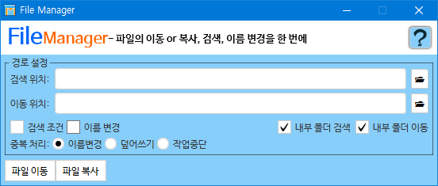
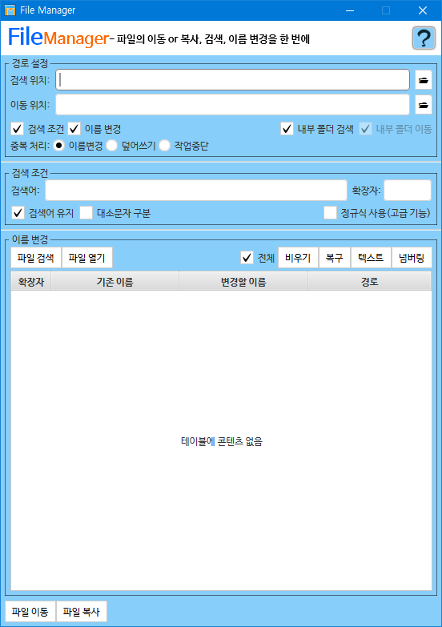

# File Manager
`File Manager`는 파일의 검색, 이름 변경, 이동 혹은 복사를 한 번에 실행할 수 있는 프로그램입니다.
## 설명(v1.1.1)

- 기본 기능인 이동과 복사만 쓰는 형태에서 검색과 이름 변경까지 기능을 확장할 수 있습니다.
- 경로 내에 폴더가 있을 때의 처리를 골라서 할 수 있습니다.
- 이동할 위치에 중복되는 파일이 있을 때의 처리를 골라서 할 수 있습니다.
- 검색어로 정규식 사용 여부를 정할 수 있습니다.(Java, Go 기준)
- 이름 변경 시엔 파일을 검색, 파일 열기 창, 파일(또는 폴더)를 끌어다 놓아서 추가할 수 있습니다.
- 이름 변경 시엔 파일을 `Delete`로 삭제할 수 있으며, 아이템을 끌어다 놓아서 위치를 바꿀 수 있습니다.
 또한 원한다면 변경할 셀을 두 번 클릭해서 이름을 개별로 수정할 수 있습니다.
- 이름 변경 시엔 파일을 우클릭하여 파일의 정보를 확인할 수 있습니다.(이미지와 텍스트는 내용 미리보기가 가능)
- `Settings.properties`파일에서 원하는 폰트 및 UI 설정을 적용할 수 있습니다.
### 히스토리
- 1.0.0(19.3.25 7 PM) - 출시
- 1.1.0(19.3.27 1:30 AM)
  - 폰트 JXF 파일이 임시 폴더에 남게 되는 문제 해결
  - 이르 변경 시의 이미지, 텍스트 미리보기 기능 추가
  - 폰트 설정 추가
- 1.1.1(19.3.28 4:10 PM)
  - UI 관련 설정 일부를 `Settings.properties` 파일로 추출, 외부에서 수정 가능하도록 변경
  - 폰트가 적용되지 않던 부분을 마저 적용
  - 텍스트 미리보기를 20줄 또는 1024 글자까지 확대
  - 인코딩 타이핑 오류를 해결